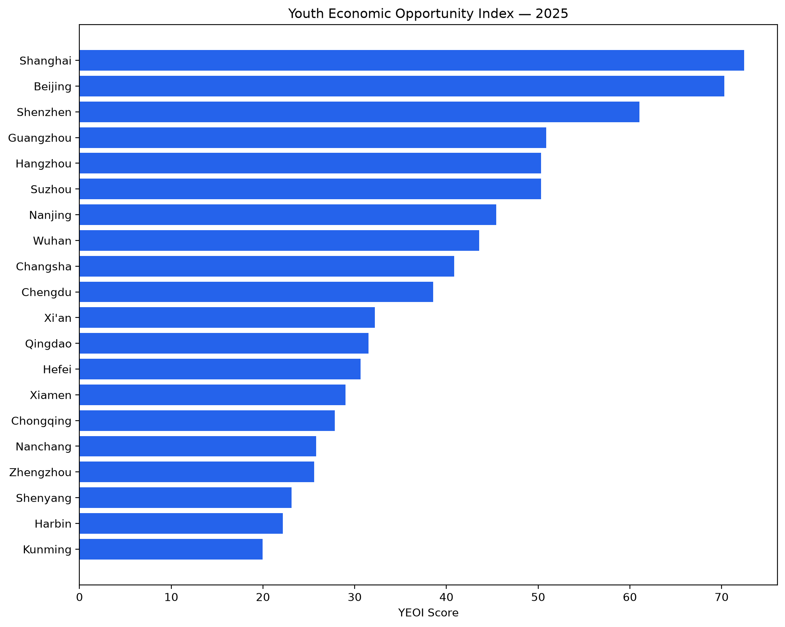
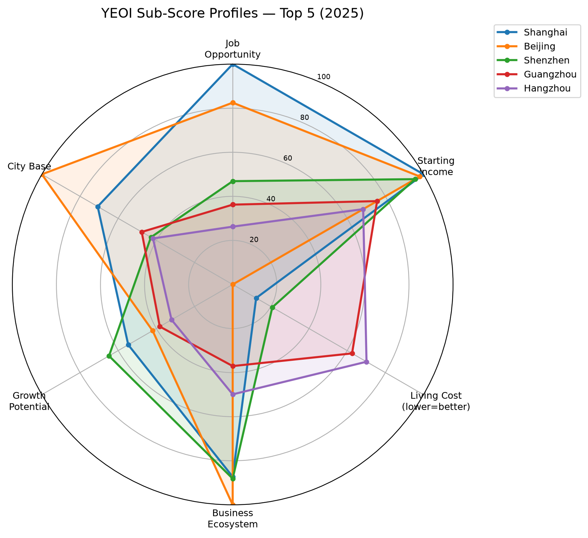
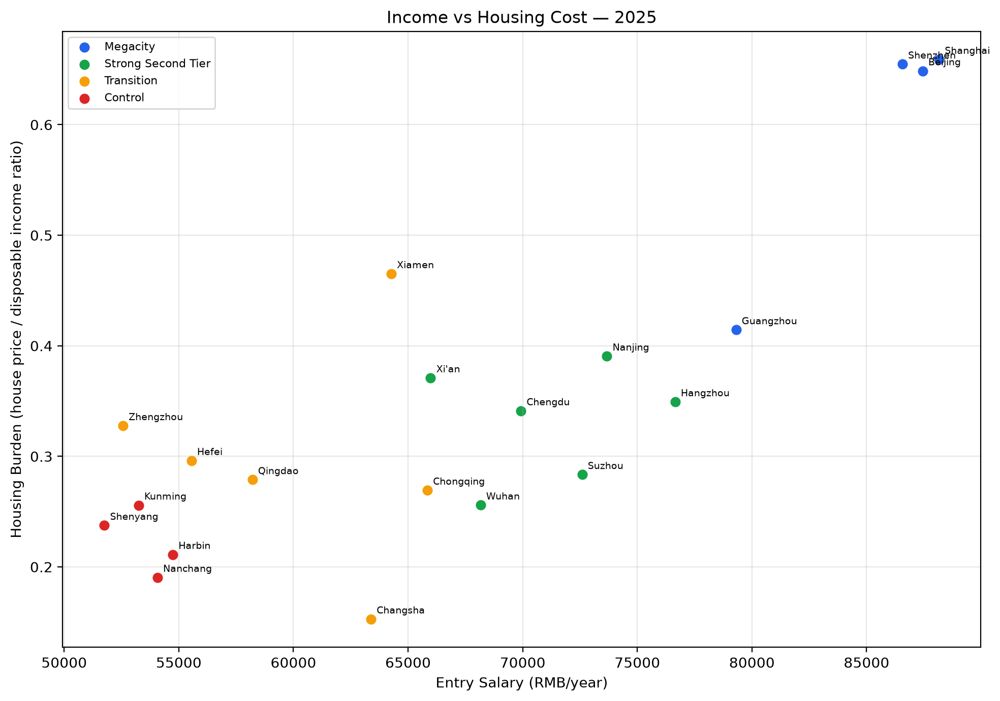
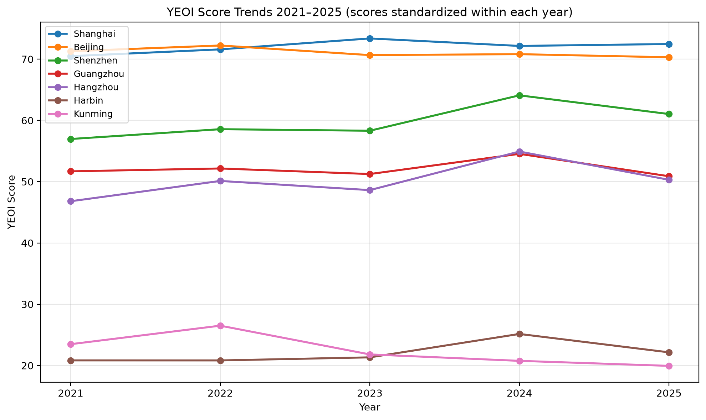

# Youth Economic Opportunity Index (YEOI)


A transparent, data-driven analysis of urban economic opportunity for young professionals in China — covering jobs, starting income, living cost and city attractiveness.

## Research Question

> For young people, which Chinese cities provide the best balance between job opportunity, starting income and living cost?

The project builds a transparent and interpretable Urban Economic Opportunity Index (YEOI) for young professionals and early-career workers — not a housing price forecast or black-box machine learning model.

## Quick Start

```bash
uv sync
uv run yeoi-download   # Optional: refresh raw data
uv run yeoi-build      # Build YEOI (generates processed CSVs)
uv run streamlit run app/streamlit_app.py
```

> **Note:** Processed CSVs in `data/processed/` are gitignored. Run `yeoi-build` after cloning to regenerate them. README charts in `reports/figures/` are committed and viewable on GitHub.

## Methodology Overview

```text
YEOI = 0.20 × JobOpportunity
     + 0.20 × StartingIncome
     + 0.20 × LivingCostAffordability
     + 0.20 × BusinessEcosystem
     + 0.10 × GrowthPotential
     + 0.10 × HumanCapitalCityBase
```

Each component is a **0–100 standardized score** computed within each year's city cross-section; the living cost dimension is inverse-normalized so higher scores indicate lower pressure.

| Dimension | Weight | Economic Meaning |
|-----------|--------|-------------------|
| Job Opportunity | 0.20 | Job postings or employment capacity proxy |
| Starting Income | 0.20 | Entry-level salary or disposable income return |
| Living Cost Affordability | 0.20 | Rent / housing price relative to income |
| Business Ecosystem | 0.20 | Career opportunities from listed and high-tech firms |
| Growth Potential | 0.10 | Long-term opportunity from population inflow and innovation |
| Human Capital / City Base | 0.10 | University resources and city economic base |

Third-party data (job postings, rent) enters the main ranking only after passing a credibility threshold (≥80% city coverage); see [docs/methodology.md](docs/methodology.md) for full details.

## 2025 Ranking Snapshot

| Rank | City | YEOI Score | Job | Income | Living Cost | Business | Growth | City Base |
|------|------|-----------|-----|--------|-------------|----------|--------|-----------|
| 1 | Shanghai | 72.5 | 100.0 | 100.0 | 12.3 | 87.3 | 54.7 | 70.8 |
| 2 | Beijing | 70.3 | 82.5 | 98.0 | 0.0 | 100.0 | 42.0 | 100.0 |
| 3 | Shenzhen | 61.0 | 46.9 | 95.6 | 20.8 | 88.1 | 64.8 | 42.8 |
| 4 | Guangzhou | 50.9 | 36.2 | 75.7 | 62.6 | 37.0 | 38.2 | 47.7 |
| 5 | Hangzhou | 50.3 | 26.2 | 68.4 | 70.1 | 49.9 | 32.0 | 41.8 |



## Dimension Profiles

Sub-score radar chart for the top 5 cities in 2025, revealing each city's strengths and trade-offs across the six YEOI dimensions.



Beijing and Shanghai dominate on job opportunity and income but score lowest on living cost affordability. Guangzhou and Hangzhou offer a more balanced profile with significantly lower housing pressure.

## Income vs Housing Cost

Entry salary versus housing burden for 20 cities in 2025, colored by city group. The x-axis shows raw entry-level salary (RMB/year); the y-axis shows housing burden (house price divided by disposable income). The dashboard's Trade-offs tab extends this view with a toggle between housing and rent burden.



Megacities (Beijing, Shanghai, Shenzhen) cluster in the high-income / high-burden quadrant. Transition cities (Changsha, Chongqing) offer moderate salaries with the lowest housing burden — a trade-off central to the research question.

## Score Trends 2021–2025

YEOI scores for the 2025 top 5 cities plus Harbin and Kunming as lower-ranked control cities. Scores are standardized within each year, so cross-year levels reflect relative standing, not absolute improvement in raw metrics. The dashboard's Trends tab allows interactive city selection and side-by-side rank tracking.



## Interactive Dashboard

The Streamlit dashboard turns the static index outputs into an interactive conclusion-checking tool. It follows the same evidence chain as the project analysis: ranking result, dimension explanation, income-cost trade-off, time stability, and weight robustness.

Run locally:

```bash
uv run streamlit run app/streamlit_app.py
```

Dashboard tabs:

| Tab | Purpose |
|-----|---------|
| Overview | Ranking result, selected-city position, and key metrics |
| City Profile | Dimension scores, radar comparison, raw metrics, and source metrics |
| Trade-offs | Entry salary versus housing/rent burden, colored by city group |
| Trends | 2021–2025 YEOI score and rank stability |
| Sensitivity & Data Quality | Weight robustness and credibility tiers |

The dashboard is designed to test whether high-ranking cities are genuinely balanced, or whether their scores are driven by a single advantage such as income, enterprise density, or city base.

## Data Coverage

The index draws on 16 core panel fields across three credibility tiers:

| Tier | Description | Fields | Eligible for Main Index? |
|------|-------------|--------|--------------------------|
| A | Official statistical yearbooks, communiques, NBS | 9 | Yes |
| B | Institutional public data (listed company domiciles, enterprise directories) | 3 | Yes (requires source record) |
| C | Platform samples (recruitment sites, rental platforms) | 4 | Yes (requires ≥80% city coverage) |

Tier C metrics enter the core index only when ≥80% of sample cities have non-missing values in a given year. See [data/data_dictionary.md](data/data_dictionary.md) for the full field list.

## Key Outputs

| File | Description |
|------|-------------|
| `data/processed/city_economic_opportunity.csv` | City × year panel (gitignored, run `yeoi-build`) |
| `data/processed/yeoi_scores.csv` | YEOI sub-scores and rankings (gitignored, run `yeoi-build`) |
| `data/processed/sensitivity_report.csv` | Weight sensitivity analysis (gitignored) |
| `reports/figures/*.png` | README chart images (committed) |
| `app/streamlit_app.py` | Interactive conclusion-supporting dashboard: ranking, city profile, trade-offs, trends, sensitivity |

## Project Structure

```
youth-economic-opportunity-index/
├── src/yei/              # Core library (config, build, clean, visualize, sensitivity)
├── app/                  # Streamlit dashboard
├── data/
│   ├── raw/              # Source observations and external data
│   └── processed/        # Build outputs (gitignored)
├── docs/                 # Methodology, architecture, data design
├── notebooks/            # Exploratory analysis (01–04)
├── scripts/              # Data fetching and chart generation
├── tests/                # pytest test suite
└── reports/figures/      # README chart PNGs (committed)
```

## Documentation

- [Project Overview](docs/overview.md)
- [Data Design](docs/data-design.md)
- [Methodology](docs/methodology.md)
- [Data Dictionary](data/data_dictionary.md)
- [Architecture](docs/architecture.md)
- [Data Improvement Log](docs/data_improvement_log.md)

## Tech Stack

Python 3.12+ · uv · pandas · matplotlib · plotly · streamlit · pytest · ruff

## Author

**Zhang Yuyang** — zhangyuyang0126@yeah.net

## License

MIT
